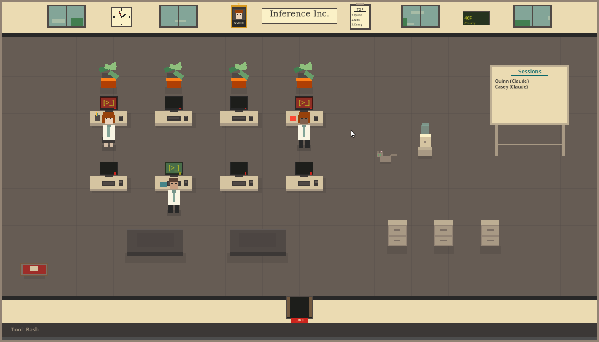

# Inference Inc.

A virtual office that visualizes Claude Code, Codex CLI, and Clawdbot sessions. Little agents spawn, claim desks, and type away based on transcript activity.



## What is this?

Inference Inc. is a desktop companion app that watches your Claude Code session files and spawns animated office workers when agents start working. They:

- Walk to desks and type while working
- Show what tool they're currently using
- Deliver completed work to the shredder or filing cabinet
- Wander to the water cooler when idle
- Pet the office cat

It doesn't do anything useful - it's purely a visualizer. But it's fun to have running while Claude works.

## Features

- **8 desks** with monitors that light up when occupied
- **Draggable furniture** - rearrange the office however you like
- **Office cat** that wanders, sleeps, and meows
- **Opt-in live weather** with rain and snow
- **Day/night cycle** that follows real time
- **Agent mood system** - agents get tired after long sessions
- **Achievements and leveling** for your agents
- **Session tracking** - see which Claude sessions are active

## Installation

Download the latest release for your platform:

- [itch.io](https://pknull.itch.io/inference-inc)
- [GitHub Releases](https://github.com/pknull/ccworkspace/releases)

### How it works

The app monitors local harness transcript files and detects when agents spawn, use tools, and complete work. Watcher paths can be changed in Settings.

### Optional: MCP Server

The app includes a loopback-only MCP server for external control of office features. It is disabled by default; enable it in Settings when local tools need office control.

Live weather is also disabled by default. Enabling automatic location sends the public IP address to ipapi.co, then uses Open-Meteo for forecasts.

## Requirements

- Claude Code, Codex CLI, or Clawdbot (for transcript-driven agent activity)
- Linux x86-64 for current reviewed builds. Windows and macOS packaging is paused until the patched native terminal extension is built on those platforms.

## Building from Source

Requires Godot 4.5:

```bash
python3 -m pip install scons==4.10.1
cd agent-office
./scripts/build_godot_xterm_linux.sh
godot --export-release "Linux" builds/inference-inc.x86_64
```

Keep `libgodot-xterm.linux.template_release.x86_64.so`, emitted beside the
executable, in the same directory when running or packaging the application.

## Alpha Status

This is still alpha software. Bugs expected. If you find issues or have suggestions, please report them on [GitHub Issues](https://github.com/pknull/ccworkspace/issues).

## Acknowledgments

Inspired by [claude-office](https://github.com/paulrobello/claude-office) by Paul Robello.

## License

MIT
