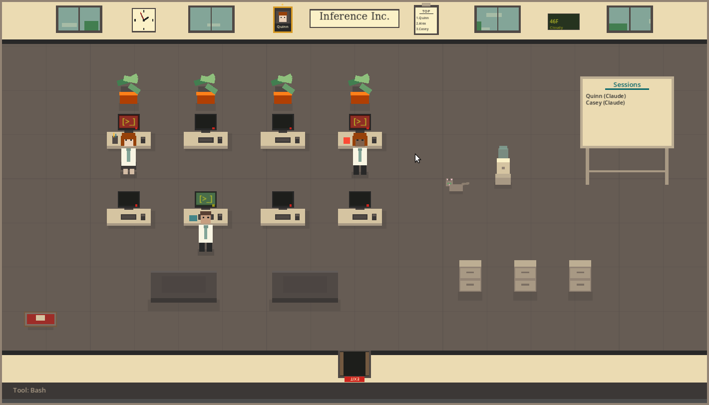

# Inference Inc.

A virtual office that visualizes your Claude Code sessions. Little agents spawn, claim desks, and type away based on what's happening in your Claude Code instance.



## What is this?

Inference Inc. is a desktop companion app that connects to Claude Code via MCP and spawns animated office workers when agents start working. They:

- Walk to desks and type while working
- Show what tool they're currently using
- Deliver completed work to the shredder or filing cabinet
- Wander to the water cooler when idle
- Pet the office cat

It doesn't do anything useful - it's purely a visualizer. But it's fun to have running while Claude works.

## Features

- **8 desks** with monitors that light up when occupied
- **Draggable furniture** - rearrange the office however you like
- **Office cat** that wanders, sleeps, and meows
- **Weather system** with rain and snow
- **Day/night cycle** that follows real time
- **Agent mood system** - agents get tired after long sessions
- **Achievements and leveling** for your agents
- **Session tracking** - see which Claude sessions are active

## Installation

Download the latest release for your platform:

- [itch.io](https://pknull.itch.io/inference-inc)
- [GitHub Releases](https://github.com/pknull/ccworkspace/releases)

### MCP Setup

Add this to your Claude Code MCP configuration (`~/.claude/settings.json`):

```json
{
  "mcpServers": {
    "agent-office": {
      "command": "nc",
      "args": ["localhost", "9999"]
    }
  }
}
```

Or configure the built-in MCP server (Settings menu in-app).

## Requirements

- Claude Code (for the visualization to show anything)
- Windows, macOS, or Linux

## Building from Source

Requires Godot 4.5:

```bash
cd agent-office
godot --export-release "Linux" builds/inference-inc.x86_64
```

## Alpha Status

This is still alpha software. Bugs expected. If you find issues or have suggestions, please report them on [GitHub Issues](https://github.com/pknull/ccworkspace/issues).

## License

MIT
